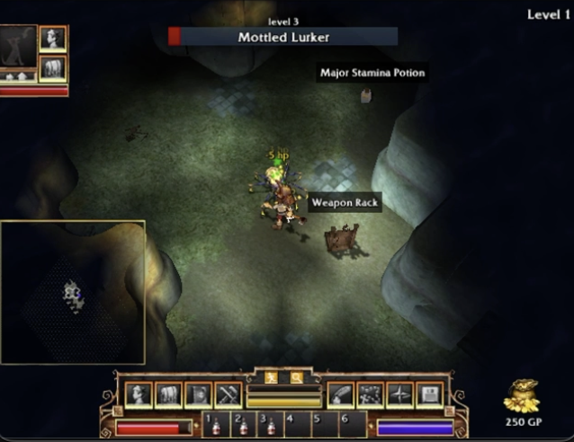
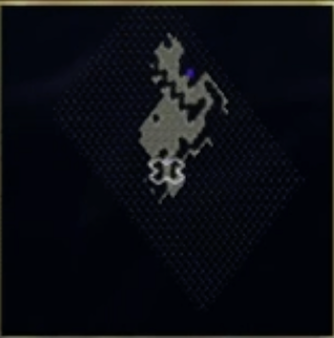

# Play FATE

State machine galore:
- Perception Layer
  - ✅ Health
  - Enemies in area
  - Stamina
  - Inventory management
- Planner Layer
  - Hierarchy of goals e.g get stronger -> dungeon combat -> collect valuables -> sell valubles -> buy better gear
  - Escape routes during combat
  - 
- Action Layer
  - ✅ macOS CoreGraphics controls for mouse / keyboard events

## Facts about the game
The character is always at the center of the screen.

The current location is always at the top right of the screen.

When an enemy is hovered over by the mouse, we get their name and health bar at the top middle.

Theres a mode that exposes names above items in the world i.e Weapon Rack in the photo below. 

There is a minimap that can always be present on screen showing the navigable areas.

## OCR
We will need OCR for certain things in the game: health, XP, damage popups, GP. These are in set locations so itll be easy to captur reliably.

I think we should use the Apple Vision Framework (`VNRecognizeTextRequest`) as its already on macOS and wicked fast and accurate. Far better than linking Tesseract if it delivers.

We can sweep the screen in chunks, analyzing text, if any, and if so, feed it into the planner layer to have it decide if its advantageous for the bot to click on said thing. This is mainly applicable when we are scanning the dungeon floor for useful loot.

## Potential Exploitable Heuristic Strategies
Enemy scanning technique = click in direction you want to go, move mouse in circle around player to scan for enemies. 

## Navigation

The bottom left minimap is a godsend. We can likely use it exclusively as means of navigating via some traditional Djisktra or A* algorithm when in planning mode.

## Open Questions
- How do we decide which enemy to attack? Do we build up a roster with stats? Do we check how much damage we do to the enemy, and approximate their health? We need an effective combat strategy.